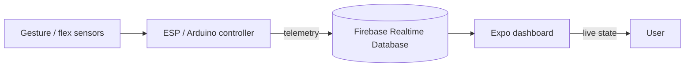

# PsychMatrix

### Empowering users through advanced interactive control

PsychMatrix is an assistive, gesture-based home-automation system that connects an ESP/Arduino controller to a Firebase Realtime Database and a cross-platform Expo dashboard. It is designed to make environmental controls and safety signals easier to observe and operate.

[](https://github.com/rifat-binreza/PSYCHMATRIX-EMPOWERING-USERS-THROUGH-ADVANCED-INTERACTIVE-CONTROL/actions/workflows/ci.yml)
[](LICENSE)
[](https://expo.dev/)
[](https://www.typescriptlang.org/)

> **Status:** Active prototype / thesis project. Hardware and Firebase credentials are intentionally not included.

## Why PsychMatrix?

Home automation should provide clear feedback, not another complicated interface. PsychMatrix combines gesture input, sensor telemetry, and a simple live dashboard so users can see the state of their environment at a glance.

### Highlights

- **Live telemetry** — subscribes to the `controller/` Firebase Realtime Database node.
- **Safety-focused signals** — emergency, alcohol detection, temperature, humidity, and MQ3 values.
- **Device visibility** — shows fan and light states alongside sensor data.
- **Cross-platform dashboard** — runs with Expo on Android, iOS, and web.
- **Hardware-ready** — includes ESP/Arduino sketches and room/flex simulations.
- **Quality gates** — strict TypeScript, ESLint, Prettier, and GitHub Actions CI.
- **Credential-safe by default** — local Firebase and firmware secrets are excluded from Git.

## Architecture



## Repository map

```text
.
├── app/                  # Expo Router screens
├── components/           # Reusable React Native UI
├── hooks/                # Shared React hooks
├── assets/               # App imagery and diagrams
├── *.ino                 # ESP, Arduino, and simulation sketches
├── .github/workflows/    # CI automation
├── CONFIG.md             # Firebase and hardware setup
└── package.json          # App scripts and dependencies
```

## Quick start

### Prerequisites

- Node.js `20.19+` and npm
- Expo-compatible Android or iOS tooling for native builds
- A Firebase project with Realtime Database enabled

### Install and run

```sh
npm ci
npm run typecheck
npm run lint
npm run format:check
npm start
```

Then use the Expo developer menu, or run one of:

```sh
npm run android
npm run ios
npm run web
```

For Firebase native builds, add the platform configuration files locally as described in [`CONFIG.md`](CONFIG.md). They are ignored by Git and must not be committed.

## Data contract

The dashboard expects this shape at `controller/`:

```json
{
  "devices": {
    "emergency": false,
    "fan": false,
    "light": false
  },
  "sensors": {
    "alcohol_detected": false,
    "humidity": 0,
    "mq3": 0,
    "temperature": 0
  }
}
```

Keep this contract stable between firmware and the app. Changes should be documented in the same pull request.

## Firmware and secrets

Firmware credentials must be supplied locally through a secret header or your board platform's secret manager. Never commit Wi-Fi passwords, Firebase tokens, private keys, or production database credentials. If a credential has ever been committed, rotate it before deploying.

See [`CONFIG.md`](CONFIG.md) for the complete setup guidance and [`SECURITY.md`](SECURITY.md) for reporting vulnerabilities.

## Development workflow

Every pull request runs the quality pipeline in [`.github/workflows/ci.yml`](.github/workflows/ci.yml). Before opening a PR, run:

```sh
npm run typecheck && npm run lint && npm run format:check
```

Please keep changes focused, explain hardware or schema changes, and include screenshots for meaningful UI changes.

## Roadmap

- [ ] Add authenticated Firebase access and production database rules
- [ ] Add explicit connection/offline status to the dashboard
- [ ] Add automated tests for Firebase data normalization
- [ ] Replace placeholder imagery with final project assets
- [ ] Document a reproducible firmware build for each supported board

## License

Distributed under the [MIT License](LICENSE).
